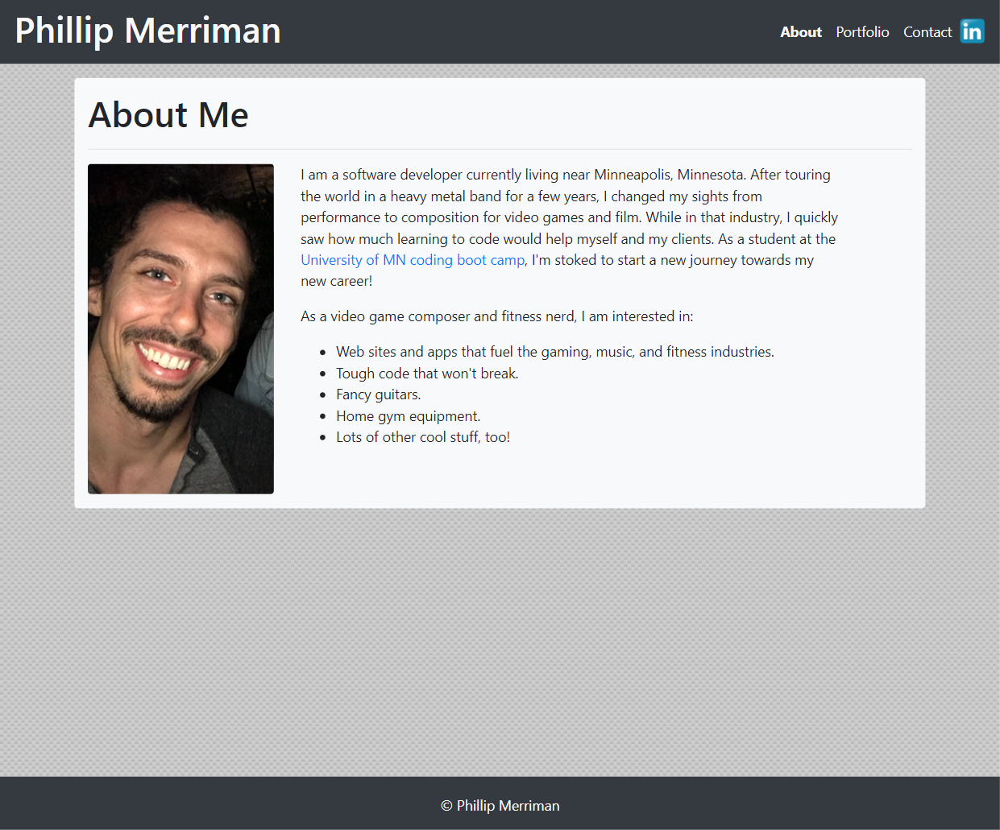

# responsive-portfolio-with-bootstrap
This portfolio will serve as a continuous project throughout my career, a central hub for my most impressive projects, as well as my resume and contact info. The purpose of this portfolio is to synthesize my graduate and professional experience. Within this portfolio you will find examples of professional and academic work that crystalizes important parts of my development as a software/web developer.

## Motivation
This portfolio is created to provide tangible proof of my value in the workplace. By outlining project descriptions and showcasing work samples, providing quick and easy access to my resume, and offering up letters of reference, this portfolio will document my professional accomplishments in a way that makes sense for the job and career I am pursuing.

## Build status
Initial build

 
## Screenshots

## Credits
Contact form template taken from https://bootstrapious.com/p/how-to-build-a-working-bootstrap-contact-form 

#### Anything else that seems useful

## License
A short snippet describing the license (MIT, Apache etc)

© [Phillip Merriman](phillipmerriman.github.io)